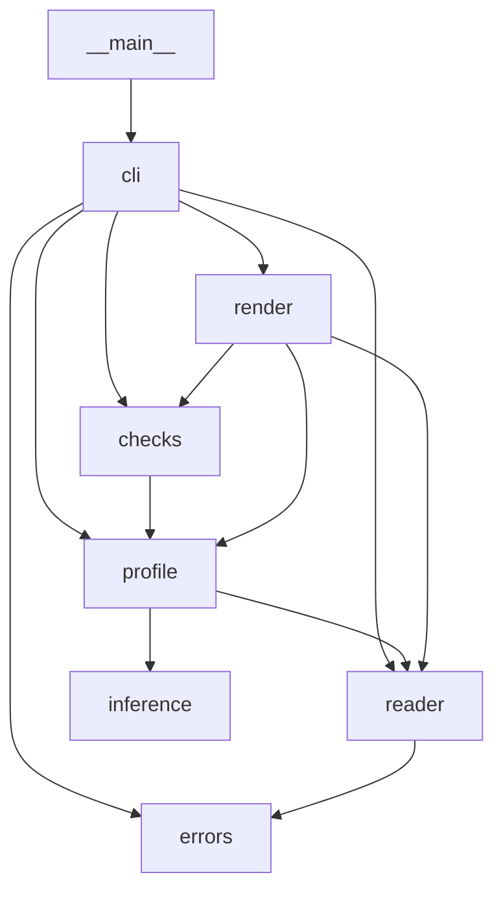

# csv-quality-report

> **Status: prototype/alpha.** Maintained by [rodrix91](https://github.com/rodrix91). Interfaces and output formats may change without notice.

A small command-line tool that gives a quick data-quality check of a CSV file before you use it.

## Problem and scope

Before loading a CSV into a notebook or pipeline, analysts and engineers usually want a fast answer to: *what types are these columns, how much is missing, are there duplicate rows, and what do the values look like?* `csv-quality-report` answers that for one local file with one command.

Per column it reports:

- inferred type (`int`, `float`, `bool`, `date`, `datetime`, `string`)
- missing count and percentage
- distinct count (non-missing values)
- min / max (numeric and date columns)
- top 3 most frequent values (configurable with `--top`)

At dataset level it reports the row count and the number of duplicate rows.

Out of scope: data cleaning, schema validation, non-UTF-8 encodings, network sources.

## Requirements

- Python 3.11 or newer
- Runtime dependencies: **none** (standard library only)
- Development: `pytest`, `ruff`, `mypy`, `build` (pinned in `requirements-dev.txt`; full pins with hashes in `requirements-dev.lock`)

## Install

From a clone of this repository:

```bash
python3 -m venv .venv
. .venv/bin/activate
pip install --require-hashes -r requirements-dev.lock   # exact pins with hashes (alternative: -r requirements-dev.txt)
pip install -e .
```

You can also run the tool without installing it: `PYTHONPATH=src python3 -m csv_quality_report FILE`. Installing the package (`pip install -e .`) is only needed for the `csv-quality-report` command or for using it from other environments; the test suite does **not** require it.

## Usage

```text
python -m csv_quality_report PATH [--format markdown|json] [--max-rows N] [--delimiter CHAR] [--decimal-comma] [--na TOKENS] [--top N] [--json-output FILE]
                             [--max-missing PCT] [--max-missing-column NAME=PCT ...] [--max-duplicates N] [--require-columns NAMES]
python -m csv_quality_report --version
```

- `PATH` — the CSV file. Use `-` to read standard input. Gzip-compressed input (`.csv.gz`, or a compressed pipe) is detected from its first bytes and decompressed while streaming; no flag is needed.
- `--format` — `markdown` (default) or `json`.
- `--max-rows N` — analyze only the first `N` data rows (`N >= 1`). The output says when it stopped early (`truncated` in JSON).
- `--delimiter CHAR` — field separator (default `,`). Accepts one character, the aliases `tab`, `comma`, `semicolon` and `pipe`, or `auto` (see below). Use `--delimiter ";"` for files exported from spreadsheets with a Spanish, Portuguese or other comma-decimal locale. Decimal commas (`10,5`) are only parsed as numbers with `--decimal-comma`.
- `--delimiter auto` — detect the separator among `,` `;` tab and `|`. A candidate is accepted only if it gives the same number of fields (more than one) on every one of the first 100 lines (within 64 KiB); quoted fields are respected. If exactly one candidate fits, it is used; a file where every candidate gives one field is treated as a one-column file; otherwise the tool stops with exit code 7 instead of guessing. The chosen delimiter is shown in the report.
- `--decimal-comma` — read floats written with a comma as decimal mark (`10,5`, `-0,25`). With the flag, values written with `.` are no longer floats, thousands separators (`1.234,5`) are not recognized, and `1,234` means 1.234. Top values keep the original text; min/max are reported as numbers.
- `--json-output FILE` — also write the JSON report (the same content as `--format json`, including `checks`) to `FILE`, while stdout keeps the chosen `--format`. The data is profiled once. The file is written even when a quality gate fails, so CI can keep it as an artifact; reading errors write no file, and a file that cannot be written stops with exit code 9.
- `--top N` — how many most frequent values to list per column (default 3; `0` lists none). JSON reports the setting as `top_n`.
- `--na TOKENS` — comma-separated cell values to count as missing, in addition to empty cells, e.g. `--na NA,null,s/d`. Matching is exact and case-sensitive after stripping spaces. A token list that starts with `-` must be attached with `=`: `--na=-,NA`. Missing tokens are excluded from type inference, distinct counts and top values, so a quantity column with `NA` gaps is still reported as `int`. Duplicate-row detection keeps comparing the raw text.

### Pipes and compressed files

The input is streamed, so it can come straight from another command, compressed or not:

```bash
gunzip -c shipments.csv.gz | python -m csv_quality_report - --delimiter auto
python -m csv_quality_report shipments.csv.gz --format json     # decompressed on the fly
curl -s https://example.org/export.csv | python -m csv_quality_report - --max-duplicates 0
```

On standard input the report names the source `<stdin>`. `--delimiter auto` works on pipes too: it reads its sample, completes the current line and keeps reading the same stream, without seeking. Two limits come with pipes: a non-UTF-8 byte cannot be located by re-reading, so the error says the offset is not available; and corrupt or truncated gzip data stops with exit code 3. For gzip files on disk, the offset of an invalid byte is counted in the decompressed data.

### Quality gates for pipelines

By default the tool only reports. With thresholds it also decides: the full report is still printed to stdout, every failed check is printed to stderr as `check failed: ...`, and the exit code is **8** when at least one check fails (0 when all pass). A value equal to its limit passes.

- `--max-missing PCT` — fail if any column has more than `PCT` % missing values (0 to 100). The comparison uses the exact percentage, not the rounded `missing_pct` shown in the table.
- `--max-missing-column NAME=PCT` — a missing-value limit for one column, overriding `--max-missing` for it; repeat the option for several columns, and use it with or without `--max-missing` (for example, `--max-missing 5 --max-missing-column comment=100 --max-missing-column shipment_id=0`). The name is exact and case-sensitive and is split from the value at the last `=`; if a name is given twice, the last limit wins. A limit for a column that is not in the header fails as a `required_column` check instead of being ignored, since it usually means a typo or a renamed column.
- `--max-duplicates N` — fail if the file has more than `N` duplicate rows (`0`: none allowed).
- `--require-columns NAMES` — fail for each comma-separated column that is not in the header, for example when the exporting system renamed or dropped a field. Matching is exact and case-sensitive against the header as reported (after `_2`, `_3` suffixes for repeated names); the message lists the columns that are present. In JSON each required column is a `required_column` check with `value` 1 (present) or 0 (missing).

JSON output always has a `checks` list (empty without thresholds); each item has `check`, `column` (`null` for file-level checks), `limit`, `value` and `passed`. Markdown adds a `## Checks` section only when thresholds are given.

Example: stop a nightly import when an extract has gaps or repeated rows (the step fails on exit code 8):

```yaml
- name: Check the shipments extract before loading it
  run: python -m csv_quality_report data/shipments.csv --delimiter auto --na NA,s/d --max-missing 5 --max-duplicates 0 --require-columns shipment_id,date,weight_kg
```

### Example: Markdown (default)

`examples/sample.csv` contains 8 data rows, one exact duplicate row and several empty cells. Command (run from the repository root):

```bash
python -m csv_quality_report examples/sample.csv
```

Output (captured from a real run, exit code 0):

```markdown
# CSV quality report: examples/sample.csv

- Rows analyzed: 8
- Columns: 8
- Duplicate rows: 1

| Column | Type | Missing | Missing % | Distinct | Min | Max | Top 3 values |
|---|---|---|---|---|---|---|---|
| id | int | 0 | 0.0 | 7 | 1 | 7 | 5 (2), 1 (1), 2 (1) |
| name | string | 0 | 0.0 | 7 |  |  | Elena (2), Alice (1), Bob (1) |
| signup_date | date | 1 | 12.5 | 6 | 2024-01-15 | 2024-04-18 | 2024-03-11 (2), 2024-01-15 (1), 2024-02-03 (1) |
| age | int | 2 | 25.0 | 5 | 29 | 52 | 38 (2), 34 (1), 29 (1) |
| score | float | 1 | 12.5 | 6 | 69.5 | 95.75 | 81.0 (2), 88.5 (1), 92.0 (1) |
| active | bool | 1 | 12.5 | 2 |  |  | true (4), false (3) |
| city | string | 1 | 12.5 | 3 |  |  | La Paz (4), Santa Cruz (2), Cochabamba (1) |
| last_seen | datetime | 1 | 12.5 | 6 | 2024-04-28T12:00 | 2024-05-04T08:45 | 2024-05-03T21:30 (2), 2024-05-02T09:15 (1), 2024-05-03 18:40 (1) |
```

### Example: JSON

```bash
python -m csv_quality_report examples/tiny.csv --format json
```

Output (captured from a real run, exit code 0):

```json
{
  "source": "examples/tiny.csv",
  "rows": 3,
  "truncated": false,
  "delimiter": ",",
  "delimiter_detected": false,
  "na_tokens": [],
  "top_n": 3,
  "compressed": false,
  "duplicate_rows": 0,
  "columns": [
    {
      "name": "item",
      "type": "string",
      "missing": 0,
      "missing_pct": 0.0,
      "distinct": 2,
      "min": null,
      "max": null,
      "top_values": [
        {
          "value": "apple",
          "count": 2
        },
        {
          "value": "pear",
          "count": 1
        }
      ],
      "untrimmed": 0
    },
    {
      "name": "qty",
      "type": "int",
      "missing": 1,
      "missing_pct": 33.3,
      "distinct": 2,
      "min": 3,
      "max": 5,
      "top_values": [
        {
          "value": "3",
          "count": 1
        },
        {
          "value": "5",
          "count": 1
        }
      ],
      "untrimmed": 0
    }
  ],
  "checks": []
}
```

### Behavior details

- **Untrimmed values**: cells with leading or trailing whitespace (`"AR "`) are compared after stripping, so they count as the same value as `"AR"`, but they are a data-quality problem of their own (joins and lookups fail on them). Each column reports how many non-missing cells had surrounding whitespace: `untrimmed` in JSON, and a `- Untrimmed values: code (3), city (1)` line in Markdown only when some column has them. Whitespace-only cells are missing, not untrimmed.
- **Missing value** = an empty cell or a cell with only whitespace. Other tokens such as `NA` or `null` are treated as missing only when listed with `--na`; the tokens used are reported (`na_tokens` in JSON, an `Also counted as missing` line in Markdown).
- Values are whitespace-stripped before type inference and counting.
- **Type inference** looks at all non-missing values of a column, in this order: `bool` (`true`/`false`, any case) → `int` → `float` → `date` (strict `YYYY-MM-DD`) → `datetime` (ISO 8601 date and time: `YYYY-MM-DDTHH:MM`, a space instead of `T`, optional seconds with up to 6 fraction digits, optional `Z` or `±HH:MM` / `±HHMM` / `±HH` offset; plain dates may be mixed in) → `string`. Compact or partial forms (`20261005T1430`, `2026-10-05T14`) and impossible values (hour 24, `2026-02-30`) are not dates. `0`/`1` columns are `int`. A column with no non-missing values is reported as `string`. Numbers that cannot be represented also make the column `string`: integers with more digits than Python's integer-conversion limit (4300 by default) and floats that overflow to infinity such as `1e999`. As a result the JSON output never contains `NaN` or `Infinity` (it is always standard JSON).
- **Compression in the output**: JSON always includes `compressed` (`true` for gzip input). Markdown adds `- Compression: gzip` only for compressed input.
- **Delimiter in the output**: JSON always includes `delimiter` and `delimiter_detected`. Markdown adds a `Delimiter:` line only when the delimiter is not the default comma or was detected.
- **Duplicate rows** = rows that exactly repeat an earlier row (total rows minus unique rows), comparing raw cell text. Rows are compared through a 128-bit BLAKE2b fingerprint instead of being stored, so the count is exact unless two different rows collide on 128 bits (probability below 1e-20 even for billions of rows).
- **Order of errors**: the file is read once from start to end, and the first problem met is reported. With `--max-rows`, the part of the file after the limit is not read at all.
- **Min / max**: numbers for `int` and `float` columns; ISO `YYYY-MM-DD` strings for `date` columns (earliest and latest date); for `datetime` columns the original text of the earliest and latest value, comparing values with an offset as instants (a plain date counts as midnight). A `datetime` column that mixes values with and without an offset has no range, because a local time could be in any zone. Empty for `bool` and `string`. In JSON they are numbers, strings or `null` accordingly.
- **Top values**: ties are listed in order of first appearance.
- **Duplicate column names** are made unique deterministically: later repeats get `_2`, `_3`, … suffixes (`a,a,a` → `a`, `a_2`, `a_3`; if a suffixed name already exists, the counter keeps increasing).
- **Encoding**: files must be UTF-8. A leading UTF-8 BOM is accepted and removed. Anything else (e.g. Latin-1, UTF-16) fails with exit code 4 rather than guessing.
- Fully blank lines are skipped.

### Errors and exit codes

Errors are printed to stderr as `error: ...`; nothing is written to stdout.

| Exit code | Meaning | Example message |
|---|---|---|
| 0 | Success | |
| 2 | Usage error (bad/missing arguments, e.g. `--max-rows 0`) | argparse message |
| 3 | File cannot be read (missing, directory, permissions) | `error: cannot read 'x.csv': No such file or directory` |
| 4 | Not valid UTF-8 | `error: '/tmp/lat.csv' is not valid UTF-8 (invalid byte at offset 8); re-save the file as UTF-8` |
| 5 | Empty file (no header row) | `error: '/tmp/empty.csv' is empty (no header row)` |
| 6 | Ragged row (cell count differs from header) or malformed CSV | `error: row at line 3 has 2 fields, expected 3 (from the header)` |
| 7 | `--delimiter auto` cannot pick one separator | `error: cannot detect the delimiter: several separators fit every line (comma, semicolon); pass it explicitly with --delimiter` |
| 8 | A quality gate failed (`--max-missing`, `--max-missing-column`, `--max-duplicates`, `--require-columns`); the report is still printed | `check failed: column 'weight_kg' has 12.5% missing values (limit 5%)` |
| 9 | The `--json-output` file cannot be written | `error: cannot write 'out/report.json': No such file or directory` |

## Use as a GitHub Action

The repository is also a GitHub Action, so any workflow can check its CSV files. It installs the tool from the action's own checkout, profiles the file once, writes the Markdown report to the job summary, saves the JSON report, and fails the step when a quality gate fails.

```yaml
name: Data quality
on: [push, pull_request]

jobs:
  check-extract:
    runs-on: ubuntu-latest
    steps:
      - uses: actions/checkout@v4
      - name: Check shipments.csv
        id: quality
        uses: rodrix91/csv-quality-report@main  # pin a release tag or commit SHA for reproducible runs
        with:
          path: data/shipments.csv
          args: --delimiter auto --na NA,s/d --max-missing 5 --max-duplicates 0 --require-columns shipment_id,date
      - name: Keep the JSON report
        if: always()
        uses: actions/upload-artifact@v4
        with:
          name: data-quality-report
          path: ${{ steps.quality.outputs.report-json }}
```

| Input | Default | Meaning |
|---|---|---|
| `path` | (required) | CSV file, relative to the workspace; gzip is detected |
| `args` | `""` | extra command-line options, split on whitespace (no glob expansion) |
| `python-version` | `3.12` | Python used to run the tool (3.11 or newer) |
| `summary` | `true` | write the Markdown report to the job summary |

| Output | Meaning |
|---|---|
| `exit-code` | the tool's exit code (see "Errors and exit codes") |
| `passed` | `true` when the file was read and every check passed |
| `report-json` | path of the JSON report; empty when the file could not be read |

Inputs reach the shell only through environment variables, never interpolated into the script, so a crafted `args` value cannot run commands. The action sets up its own Python with `actions/setup-python`. The repository's CI runs the action on the example files, once expecting success and once expecting a failed gate.

## Use from Python

The same engine is available as a library. These names are the supported API, importable from `csv_quality_report`: `profile_file`, `build_report`, `read_table`, `evaluate`, `render_markdown`, `render_json`, `Report`, `ColumnProfile`, `CheckResult` and `CsvQualityError`. `profile_file` takes the same options as the command line (`max_rows`, `delimiter`, `decimal_comma`, `na_tokens`, `top_n`) and streams the file.

```python
from pathlib import Path

from csv_quality_report import CsvQualityError, evaluate, profile_file, render_json

try:
    report = profile_file(Path("examples/sample.csv"), delimiter="auto", na_tokens=("NA",))
except CsvQualityError as exc:  # unreadable file, bad encoding, ragged rows...
    raise SystemExit(f"cannot profile: {exc.message} (exit code {exc.exit_code})")

print(report.rows, "rows,", report.duplicate_rows, "duplicate")
for column in report.columns:
    print(
        f"{column.name}: {column.type}, {column.missing_pct}% missing, range {column.min}..{column.max}"
    )

checks = evaluate(report, max_missing=20, required_columns=["id", "last_seen"])
failed = [check.describe() for check in checks if not check.passed]
print("checks failed:", failed or "none")

json_text = render_json(report, "examples/sample.csv", checks)  # same JSON as --format json
```

Run from the repository root, it prints:

```text
8 rows, 1 duplicate
id: int, 0.0% missing, range 1..7
name: string, 0.0% missing, range None..None
signup_date: date, 12.5% missing, range 2024-01-15..2024-04-18
age: int, 25.0% missing, range 29..52
score: float, 12.5% missing, range 69.5..95.75
active: bool, 12.5% missing, range None..None
city: string, 12.5% missing, range None..None
last_seen: datetime, 12.5% missing, range 2024-04-28T12:00..2024-05-04T08:45
checks failed: ["column 'age' has 25% missing values (limit 20%)"]
```

A test runs this example and compares its output, so it stays correct.

## Performance

The file is profiled in a single streaming pass (see [ADR 0002](https://github.com/rodrix91/csv-quality-report/blob/main/docs/decisions/0002-streaming-profile.md)). On a synthetic 1,000,000-row, 8-column logistics file (55 MB, one column of unique IDs), JSON output, CPython 3.13:

| Version | Time | Peak memory |
|---|---|---|
| 0.1 (whole file in memory) | 6.85 s | 873 MB |
| current (streaming) | 4.92 s | 234 MB |

Both versions produce identical reports. Numbers depend on the machine and on the data, mostly on how many distinct values each column has.

## Architecture



| Module (`src/csv_quality_report/`) | Responsibility |
|---|---|
| `__main__.py` | `python -m` entry; calls `cli.main` |
| `cli.py` | argument parsing, error → exit code mapping, output |
| `reader.py` | open the file lazily, decode UTF-8, detect the delimiter, yield validated rows, de-duplicate header names |
| `inference.py` | heuristic type inference for one column |
| `profile.py` | single-pass per-column statistics and duplicate-row count |
| `render.py` | Markdown and JSON output |
| `checks.py` | optional quality gates (`--max-missing`, `--max-missing-column`, `--max-duplicates`, `--require-columns`) evaluated on a finished report |
| `errors.py` | error classes and exit codes |

Design rationale and alternatives: [docs/decisions/0001-architecture.md](https://github.com/rodrix91/csv-quality-report/blob/main/docs/decisions/0001-architecture.md) and, for streaming, [docs/decisions/0002-streaming-profile.md](https://github.com/rodrix91/csv-quality-report/blob/main/docs/decisions/0002-streaming-profile.md) (in the [source repository](https://github.com/rodrix91/csv-quality-report); not included in the packages).

## Testing

```bash
python -m pytest
```

This works after installing only the dev dependencies (`pip install -r requirements-dev.txt`) from the repository root: pytest is configured with `pythonpath = ["src"]`, and the tests that start a subprocess set `PYTHONPATH=src` themselves.

Tests (`tests/`) are behavior tests that call the CLI: happy path, missing values, ragged rows, empty file, bad encoding (Latin-1, UTF-16), BOM, duplicate column names, JSON output, `--max-rows`, `--delimiter` (including detection), `--decimal-comma`, and exit codes. Two tests check that the Markdown and JSON samples in this README match a real run. Another test runs the "Use from Python" example and compares its output. CI requires 100% line and branch coverage (`coverage run -m pytest && coverage combine && coverage report`), including the CLI runs in subprocesses; the few excluded lines carry a `# pragma: no cover` with the reason. See [CONTRIBUTING.md](https://github.com/rodrix91/csv-quality-report/blob/main/CONTRIBUTING.md) (in the [source repository](https://github.com/rodrix91/csv-quality-report); not included in the packages) for lint, type-check and build commands.

## Limitations

- **Memory grows with distinct values, not file size**: the file is streamed, but exact distinct counts and top values keep one counter entry per distinct value, plus a 16-byte fingerprint per unique row. A column of unique IDs therefore still needs memory proportional to the number of rows.
- **Type inference is a heuristic**: it only recognizes the patterns listed above (e.g. no thousands separators, decimal commas only with `--decimal-comma`, no non-ISO timestamps, no `yes`/`no` booleans), and one stray value makes the whole column `string`.
- UTF-8 only (gzip compression is handled; other compressions such as zip or bz2 are not). Delimiter detection (`--delimiter auto`) only considers `,` `;` tab and `|`, and only the first 100 lines.
- With `--max-rows`, rows after the limit are not read, so problems in them are not detected.
- Min/max for floats use Python `float` parsing.

## Security notes

- Reads one local file path given on the command line, or standard input with `-`; makes no network calls and writes no files except the one named with `--json-output`. Gzip input is decompressed in a stream, with bounded memory.
- Uses only the Python standard library at runtime.
- CSV content is treated as data only (never executed). Markdown output escapes `|` and newlines in cell text but does not sanitize other Markdown, so render untrusted files' reports with care.

## Contributing

See [CONTRIBUTING.md](https://github.com/rodrix91/csv-quality-report/blob/main/CONTRIBUTING.md) in the [source repository](https://github.com/rodrix91/csv-quality-report) (not included in the packages).

## License

MIT. See the [LICENSE](https://github.com/rodrix91/csv-quality-report/blob/main/LICENSE) file (included in the [source repository](https://github.com/rodrix91/csv-quality-report), the sdist and the wheel). Copyright (c) 2026 Rodrigo Pantoja Navajas.
