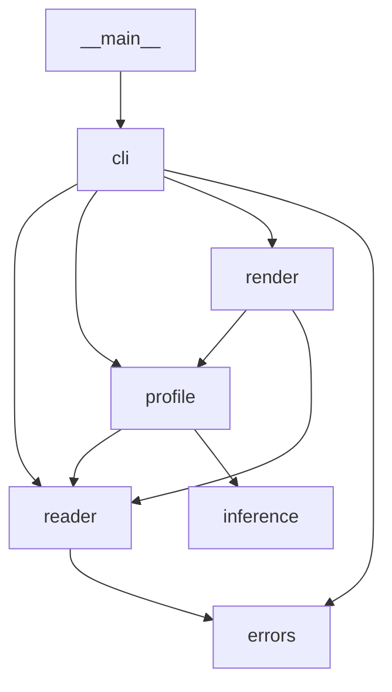

# csv-quality-report

> **Status: prototype/alpha.** Maintained by [rodrix91](https://github.com/rodrix91). Interfaces and output formats may change without notice.

A small command-line tool that gives a quick data-quality check of a CSV file before you use it.

## Problem and scope

Before loading a CSV into a notebook or pipeline, analysts and engineers usually want a fast answer to: *what types are these columns, how much is missing, are there duplicate rows, and what do the values look like?* `csv-quality-report` answers that for one local file with one command.

Per column it reports:

- inferred type (`int`, `float`, `bool`, `date`, `string`)
- missing count and percentage
- distinct count (non-missing values)
- min / max (numeric columns only)
- top 3 most frequent values

At dataset level it reports the row count and the number of duplicate rows.

Out of scope: data cleaning, schema validation, non-UTF-8 encodings, network sources.

## Requirements

- Python 3.11 or newer
- Runtime dependencies: **none** (standard library only)
- Development: `pytest`, `ruff`, `mypy`, `build` (pinned in `requirements-dev.txt`; full pins with hashes in `requirements-dev.lock`)

## Install

From a clone of this repository:

```bash
python3 -m venv .venv
. .venv/bin/activate
pip install --require-hashes -r requirements-dev.lock   # exact pins with hashes (alternative: -r requirements-dev.txt)
pip install -e .
```

You can also run the tool without installing it: `PYTHONPATH=src python3 -m csv_quality_report FILE`. Installing the package (`pip install -e .`) is only needed for the `csv-quality-report` command or for using it from other environments; the test suite does **not** require it.

## Usage

```text
python -m csv_quality_report PATH [--format markdown|json] [--max-rows N] [--delimiter CHAR] [--decimal-comma]
```

- `--format` — `markdown` (default) or `json`.
- `--max-rows N` — analyze only the first `N` data rows (`N >= 1`). The output says when it stopped early (`truncated` in JSON).
- `--delimiter CHAR` — field separator (default `,`). Accepts one character, the aliases `tab`, `comma`, `semicolon` and `pipe`, or `auto` (see below). Use `--delimiter ";"` for files exported from spreadsheets with a Spanish, Portuguese or other comma-decimal locale. Decimal commas (`10,5`) are only parsed as numbers with `--decimal-comma`.
- `--delimiter auto` — detect the separator among `,` `;` tab and `|`. A candidate is accepted only if it gives the same number of fields (more than one) on every one of the first 100 lines (within 64 KiB); quoted fields are respected. If exactly one candidate fits, it is used; a file where every candidate gives one field is treated as a one-column file; otherwise the tool stops with exit code 7 instead of guessing. The chosen delimiter is shown in the report.
- `--decimal-comma` — read floats written with a comma as decimal mark (`10,5`, `-0,25`). With the flag, values written with `.` are no longer floats, thousands separators (`1.234,5`) are not recognized, and `1,234` means 1.234. Top values keep the original text; min/max are reported as numbers.

### Example: Markdown (default)

`examples/sample.csv` contains 8 data rows, one exact duplicate row and several empty cells. Command (run from the repository root):

```bash
python -m csv_quality_report examples/sample.csv
```

Output (captured from a real run, exit code 0):

```markdown
# CSV quality report: examples/sample.csv

- Rows analyzed: 8
- Columns: 7
- Duplicate rows: 1

| Column | Type | Missing | Missing % | Distinct | Min | Max | Top 3 values |
|---|---|---|---|---|---|---|---|
| id | int | 0 | 0.0 | 7 | 1 | 7 | 5 (2), 1 (1), 2 (1) |
| name | string | 0 | 0.0 | 7 |  |  | Elena (2), Alice (1), Bob (1) |
| signup_date | date | 1 | 12.5 | 6 |  |  | 2024-03-11 (2), 2024-01-15 (1), 2024-02-03 (1) |
| age | int | 2 | 25.0 | 5 | 29 | 52 | 38 (2), 34 (1), 29 (1) |
| score | float | 1 | 12.5 | 6 | 69.5 | 95.75 | 81.0 (2), 88.5 (1), 92.0 (1) |
| active | bool | 1 | 12.5 | 2 |  |  | true (4), false (3) |
| city | string | 1 | 12.5 | 3 |  |  | La Paz (4), Santa Cruz (2), Cochabamba (1) |
```

### Example: JSON

```bash
python -m csv_quality_report examples/tiny.csv --format json
```

Output (captured from a real run, exit code 0):

```json
{
  "source": "examples/tiny.csv",
  "rows": 3,
  "truncated": false,
  "delimiter": ",",
  "delimiter_detected": false,
  "duplicate_rows": 0,
  "columns": [
    {
      "name": "item",
      "type": "string",
      "missing": 0,
      "missing_pct": 0.0,
      "distinct": 2,
      "min": null,
      "max": null,
      "top_values": [
        {
          "value": "apple",
          "count": 2
        },
        {
          "value": "pear",
          "count": 1
        }
      ]
    },
    {
      "name": "qty",
      "type": "int",
      "missing": 1,
      "missing_pct": 33.3,
      "distinct": 2,
      "min": 3,
      "max": 5,
      "top_values": [
        {
          "value": "3",
          "count": 1
        },
        {
          "value": "5",
          "count": 1
        }
      ]
    }
  ]
}
```

### Behavior details

- **Missing value** = an empty cell or a cell with only whitespace. Other tokens such as `NA` or `null` are *not* treated as missing.
- Values are whitespace-stripped before type inference and counting.
- **Type inference** looks at all non-missing values of a column, in this order: `bool` (`true`/`false`, any case) → `int` → `float` → `date` (strict `YYYY-MM-DD`) → `string`. `0`/`1` columns are `int`. A column with no non-missing values is reported as `string`. Numbers that cannot be represented also make the column `string`: integers with more digits than Python's integer-conversion limit (4300 by default) and floats that overflow to infinity such as `1e999`. As a result the JSON output never contains `NaN` or `Infinity` (it is always standard JSON).
- **Delimiter in the output**: JSON always includes `delimiter` and `delimiter_detected`. Markdown adds a `Delimiter:` line only when the delimiter is not the default comma or was detected.
- **Duplicate rows** = rows that exactly repeat an earlier row (total rows minus unique rows), comparing raw cell text. Rows are compared through a 128-bit BLAKE2b fingerprint instead of being stored, so the count is exact unless two different rows collide on 128 bits (probability below 1e-20 even for billions of rows).
- **Order of errors**: the file is read once from start to end, and the first problem met is reported. With `--max-rows`, the part of the file after the limit is not read at all.
- **Top values**: ties are listed in order of first appearance.
- **Duplicate column names** are made unique deterministically: later repeats get `_2`, `_3`, … suffixes (`a,a,a` → `a`, `a_2`, `a_3`; if a suffixed name already exists, the counter keeps increasing).
- **Encoding**: files must be UTF-8. A leading UTF-8 BOM is accepted and removed. Anything else (e.g. Latin-1, UTF-16) fails with exit code 4 rather than guessing.
- Fully blank lines are skipped.

### Errors and exit codes

Errors are printed to stderr as `error: ...`; nothing is written to stdout.

| Exit code | Meaning | Example message |
|---|---|---|
| 0 | Success | |
| 2 | Usage error (bad/missing arguments, e.g. `--max-rows 0`) | argparse message |
| 3 | File cannot be read (missing, directory, permissions) | `error: cannot read 'x.csv': No such file or directory` |
| 4 | Not valid UTF-8 | `error: '/tmp/lat.csv' is not valid UTF-8 (invalid byte at offset 8); re-save the file as UTF-8` |
| 5 | Empty file (no header row) | `error: '/tmp/empty.csv' is empty (no header row)` |
| 6 | Ragged row (cell count differs from header) or malformed CSV | `error: row at line 3 has 2 fields, expected 3 (from the header)` |
| 7 | `--delimiter auto` cannot pick one separator | `error: cannot detect the delimiter: several separators fit every line (comma, semicolon); pass it explicitly with --delimiter` |

## Performance

The file is profiled in a single streaming pass (see [ADR 0002](https://github.com/rodrix91/csv-quality-report/blob/main/docs/decisions/0002-streaming-profile.md)). On a synthetic 1,000,000-row, 8-column logistics file (55 MB, one column of unique IDs), JSON output, CPython 3.13:

| Version | Time | Peak memory |
|---|---|---|
| 0.1 (whole file in memory) | 6.85 s | 873 MB |
| current (streaming) | 4.92 s | 234 MB |

Both versions produce identical reports. Numbers depend on the machine and on the data, mostly on how many distinct values each column has.

## Architecture



| Module (`src/csv_quality_report/`) | Responsibility |
|---|---|
| `__main__.py` | `python -m` entry; calls `cli.main` |
| `cli.py` | argument parsing, error → exit code mapping, output |
| `reader.py` | open the file lazily, decode UTF-8, detect the delimiter, yield validated rows, de-duplicate header names |
| `inference.py` | heuristic type inference for one column |
| `profile.py` | single-pass per-column statistics and duplicate-row count |
| `render.py` | Markdown and JSON output |
| `errors.py` | error classes and exit codes |

Design rationale and alternatives: [docs/decisions/0001-architecture.md](https://github.com/rodrix91/csv-quality-report/blob/main/docs/decisions/0001-architecture.md) and, for streaming, [docs/decisions/0002-streaming-profile.md](https://github.com/rodrix91/csv-quality-report/blob/main/docs/decisions/0002-streaming-profile.md) (in the [source repository](https://github.com/rodrix91/csv-quality-report); not included in the packages).

## Testing

```bash
python -m pytest
```

This works after installing only the dev dependencies (`pip install -r requirements-dev.txt`) from the repository root: pytest is configured with `pythonpath = ["src"]`, and the tests that start a subprocess set `PYTHONPATH=src` themselves.

Tests (`tests/`) are behavior tests that call the CLI: happy path, missing values, ragged rows, empty file, bad encoding (Latin-1, UTF-16), BOM, duplicate column names, JSON output, `--max-rows`, `--delimiter` (including detection), `--decimal-comma`, and exit codes. Two tests check that the Markdown and JSON samples in this README match a real run. See [CONTRIBUTING.md](https://github.com/rodrix91/csv-quality-report/blob/main/CONTRIBUTING.md) (in the [source repository](https://github.com/rodrix91/csv-quality-report); not included in the packages) for lint, type-check and build commands.

## Limitations

- **Memory grows with distinct values, not file size**: the file is streamed, but exact distinct counts and top values keep one counter entry per distinct value, plus a 16-byte fingerprint per unique row. A column of unique IDs therefore still needs memory proportional to the number of rows.
- **Type inference is a heuristic**: it only recognizes the patterns listed above (e.g. no thousands separators, decimal commas only with `--decimal-comma`, no timestamps, no `yes`/`no` booleans), and one stray value makes the whole column `string`.
- UTF-8 only. Delimiter detection (`--delimiter auto`) only considers `,` `;` tab and `|`, and only the first 100 lines.
- With `--max-rows`, rows after the limit are not read, so problems in them are not detected.
- Min/max for floats use Python `float` parsing.

## Security notes

- Reads one local file path given on the command line; makes no network calls and writes no files.
- Uses only the Python standard library at runtime.
- CSV content is treated as data only (never executed). Markdown output escapes `|` and newlines in cell text but does not sanitize other Markdown, so render untrusted files' reports with care.

## Contributing

See [CONTRIBUTING.md](https://github.com/rodrix91/csv-quality-report/blob/main/CONTRIBUTING.md) in the [source repository](https://github.com/rodrix91/csv-quality-report) (not included in the packages).

## License

MIT. See the [LICENSE](https://github.com/rodrix91/csv-quality-report/blob/main/LICENSE) file (included in the [source repository](https://github.com/rodrix91/csv-quality-report), the sdist and the wheel). Copyright (c) 2026 Rodrigo Pantoja Navajas.
